Universidad Del Valle De Guatemala   4 de marzo del 2024 Diego José López Campos 

Algoritmos y estructuras de datos 

**Hoja de trabajo 5** 

1. Hacer el programa de simulación y usarlo con 25 procesos, luego con 50 procesos, con 100, 150 y 200 procesos. Su programa debe mostrar el promedio de tiempo que está el proceso en la computadora en cada caso y la desviación standard. Haga gráfica con número de procesos y tiempo promedio. 

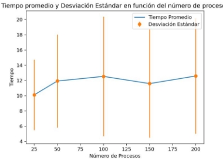

*Ilustración 1: Estándar* 

2. Vuelva a correr su simulación, pero ahora los procesos llegar más rápido, es decir en intervalos de 5. Calcule el tiempo promedio para las mismas cantidades de procesos: 25,50,100,150 y 200. Repita lo mismo para intervalos de 1 ( mucha carga de trabajo). Haga gráfica con número de procesos y tiempo promedio. 

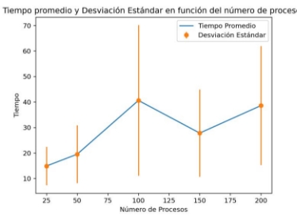

*Ilustración 2: Intervalos de 5* 

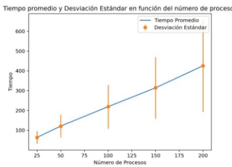

*Ilustración 3: Intervalos de 1* 

3. Revise las gráficas y trate de reducir el tiempo promedio. Pruebe con: 
1. incrementar la memoria a 200. 

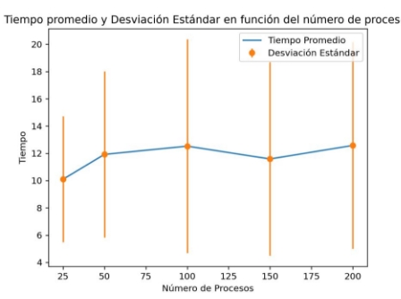

*Ilustración 4: 200 de memoria 10 de intervalo* 

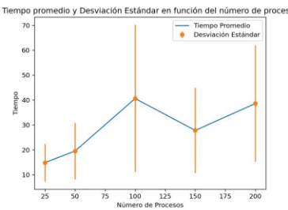

*Ilustración 5: 200 de memoria 5 de intervalo* 

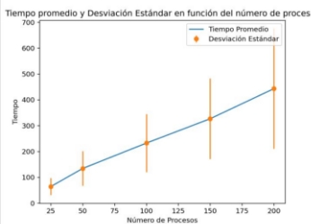

*Ilustración 6: 200 de memoria 1 de intervalo* 

2. luego con poner la memoria nuevamente a 100, pero tener un procesador más rápido (es decir que ejecuta 6 instrucciones por unidad de tiempo), 

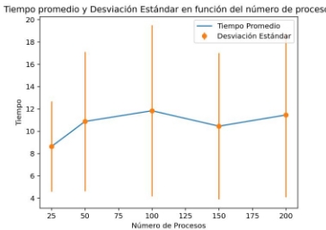

*Ilustración 7: 6 instrucciones 10 de intervalo* 

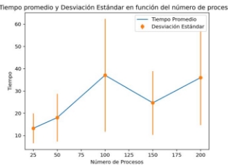

*Ilustración 8: 6 instrucciones 5 ide intervalo* 

*Ilustración 9: 6 instrucciones 1 de intervalo* 

3. luego regrese a la velocidad normal procesador pero emplee 2 procesadores. 

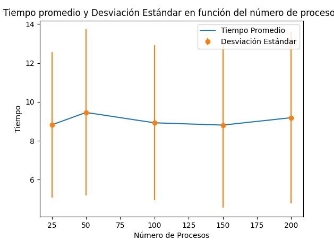

*Ilustración 10: 2 procesadores 10 de intervalo* 

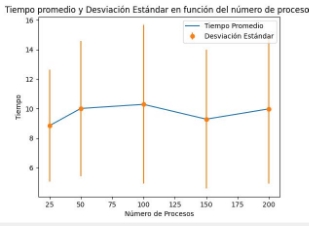

*Ilustración 11: 2 procesadores 5 de intervalo* 

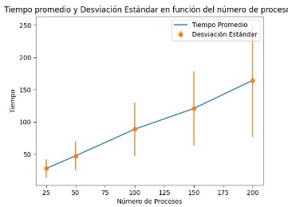

*Ilustración 12: 2 procesadores 1 de intervalo* 

Haga gráficas para cada cambio con las cantidades de 25,50,100,150 y 200 procesos (e intervalos de 10, 5, 1). Decida cuál es la mejor estrategia para reducir el tiempo promedio de ejecución de los procesos, justifique su respuesta 

**Opinión: En las pruebas realizadas la que tuvo una mayor efectividad en cuanto a  los resultados fue el aumentar la cantidad de procesadores a 2, tomar esta estrategia es muy efectiva ya que puede manejar varias tareas a la vez, así disminuyendo los tiempos de procesamiento. En cuanto el aumentar la cantidad de memoria no afecto la velocidad con la que se cumplen los procesos. El aumentar la cantidad de instrucciones aumento la velocidad de procesamiento pero de una manera mínima no tan notable. Con diferencia la mejor manera  de  acelerar  la  velocidad  de  procesamiento  es  aumentando  la  cantidad  de procesadores en funcionamiento.** 
